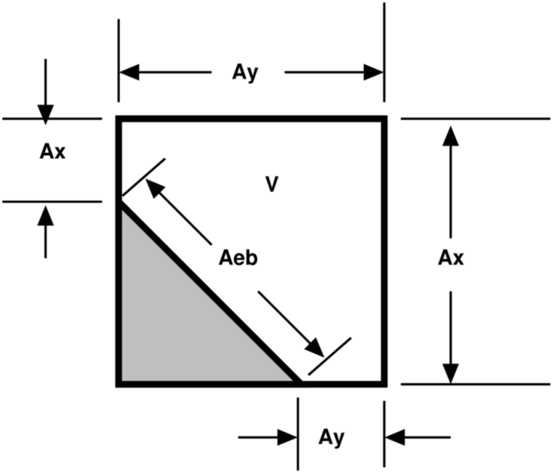
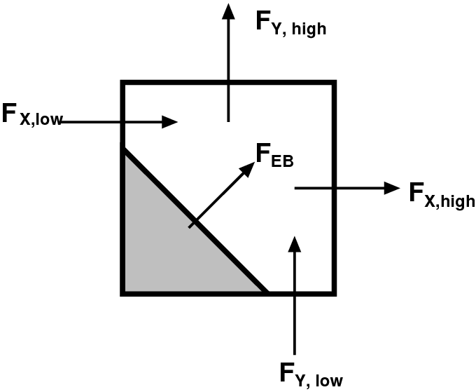
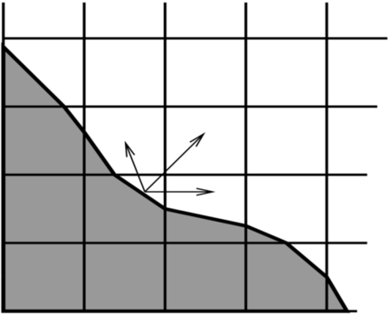

# Initializing the Geometric Database

In AMReX geometric information is stored in a distributed database class that must be initialized at the start of the calculation. The procedure for this goes as follows:

- Define an implicit function of position which describes the surface of the embedded object. Specifically, the function class must have a public member function that takes a position and returns a negative value if that position is inside the fluid, a positive value in the body, and identically zero at the embedded boundary.

``` c++
Real operator() (const Array<Real,AMREX_SPACEDIM>& p) const;
```

- Make a `EB2::GeometryShop` object using the implicit function.
- Build an `EB2::IndexSpace` with the `EB2::GeometryShop` object and a `Geometry` object that contains the information about the domain and the mesh.

Here is a simple example of initialize the database for an embedded sphere.

``` c++
Real radius = 0.5;
Array<Real,AMREX_SPACEDIM> center{0., 0., 0.}; //Center of the sphere
bool inside = false;  // Is the fluid inside the sphere?
EB2::SphereIF sphere(radius, center, inside);

auto shop = EB2::makeShop(sphere);

Geometry geom(...);
EB2::Build(shop, geom, 0, 0);
```

Alternatively, the EB information can be initialized from an STL file specified by a `ParmParse` parameter `eb2.stl_file`. (This also requires setting `eb2.geom_type = stl`.) The initialization is done by calling

``` c++
EB2::Build (const Geometry& geom,
            int required_coarsening_level,
            int max_coarsening_level,
            int ngrow = 4,
            bool build_coarse_level_by_coarsening = true);
```

Additionally one can use `eb2.stl_scale`, `eb2.stl_center` and `eb2.stl_reverse_normal` to scale, translate and reverse the object, respectively.

## Implicit Function

In `amrex/Src/EB/`, there are a number of predefined implicit function classes for basic shapes. One can use these directly or as template for their own classes.

- `AllRegularIF`: No embedded boundaries at all.
- `BoxIF`: Box.
- `CylinderIF`: Cylinder.
- `EllipsoidIF`: Ellipsoid.
- `PlaneIF`: Half-space plane.
- `SphereIF`: Sphere.

AMReX also provides a number of transformation operations to apply to an object.

- `makeComplement`: Complement of an object. E.g. a sphere with fluid on outside becomes a sphere with fluid inside.
- `makeIntersection`: Intersection of two or more objects.
- `makeUnion`: Union of two or more objects.
- `Translate`: Translates an object.
- `scale`: Scales an object.
- `rotate`: Rotates an object.
- `lathe`: Creates a surface of revolution by rotating a 2D object around an axis.

Here are some examples of using these functions.

``` c++
EB2::SphereIF sphere1(...);
EB2::SphereIF sphere2(...);
EB2::BoxIF box(...);
EB2::CylinderIF cylinder(...);
EB2::PlaneIF plane(...);

// union of two spheres
auto twospheres = EB2::makeUnion(sphere1, sphere2);

// intersection of a rotated box, a plane and the union of two spheres
auto box_plane = EB2::makeIntersection(amrex::rotate(box,...),
                                       plane,
                                       twospheres);

// scale a cylinder by a factor of 2 in x and y directions, and 3 in z-direction.
auto scylinder = EB2::scale(cylinder, {2., 2., 3.});
```

## `EB2::GeometryShop`

Given an implicit function object, say `f`, we can make a `GeometryShop` object with

``` c++
auto shop = EB2::makeShop(f);
```

## `EB2::IndexSpace`

We build `EB2::IndexSpace` with one of several functions depending on the application needs.

**Standard Build with Automatic Coarsening**

``` c++
template <typename G>
void EB2::Build (const G& gshop, const Geometry& geom,
                 int required_coarsening_level,
                 int max_coarsening_level,
                 int ngrow = 4,
                 bool build_coarse_level_by_coarsening = true,
                 bool extend_domain_face = ExtendDomainFace(),
                 int num_coarsen_opt = NumCoarsenOpt());
```

Here the template parameter is a `EB2::GeometryShop`. `Geometry` (see section `sec:basics:geom`) describes the rectangular problem domain and the mesh on the finest AMR level. Coarse level EB data is generated from coarsening the original fine data. The `int required_coarsening_level` parameter specifies the number of coarsening levels required. This is usually set to $N-1$, where $N$ is the total number of AMR levels. The `int
max_coarsening_levels` parameter specifies the number of coarsening levels AMReX should try to have. This is usually set to a big number, say 20 if multigrid solvers are used. This essentially tells the build to coarsen as much as it can. If there are no multigrid solvers, the parameter should be set to the same as `required_coarsening_level`. It should be noted that coarsening could create multi-valued cells even if the fine level does not have any multi-valued cells. This occurs when the embedded boundary cuts a cell in such a way that there is fluid on multiple sides of the boundary within that cell. Because multi-valued cells are not supported, it will cause a runtime error if the required coarsening level generates multi-valued cells. The optional `int
ngrow` parameter specifies the number of ghost cells outside the domain on required levels. For levels coarser than the required level, no EB data are generated for ghost cells outside the domain.

**Build with Explicit Multi-Level Geometry**

For applications requiring explicit control over the geometry at each AMR level:

``` c++
template <typename G>
void EB2::Build (const G& gshop, Vector<Geometry> geom,
                 int ngrow = 4,
                 bool extend_domain_face = ExtendDomainFace(),
                 int num_coarsen_opt = NumCoarsenOpt());
```

This version takes a `Vector<Geometry>` where each element corresponds to the geometry of a specific AMR level. The Vector can be unordered, as it will be sorted based on `numPts`. Unlike the standard `Build` function, coarse level EB data is generated directly from the provided geometries rather than through automatic coarsening. This is useful when coarse level domains are not simple coarsenings of the fine level, or when you need precise control over the domain and mesh spacing at each level.

**Build from STL File**

As mentioned earlier, the EB information can alternatively be initialized from an STL file using:

``` c++
void EB2::Build (const Geometry& geom,
                 int required_coarsening_level,
                 int max_coarsening_level,
                 int ngrow = 4,
                 bool build_coarse_level_by_coarsening = true,
                 bool extend_domain_face = ExtendDomainFace(),
                 int num_coarsen_opt = NumCoarsenOpt());
```

This requires setting `ParmParse` parameters `eb2.geom_type = stl` and `eb2.stl_file` to specify the STL file path.

**Managing IndexSpace Objects**

Regardless of which `Build` variant is used, the newly built `EB2::IndexSpace` is pushed on to a stack. Static function `EB2::IndexSpace::top()` returns a `const &` to the new `EB2::IndexSpace` object. We usually only need to build one `EB2::IndexSpace` object. However, if your application needs multiple `EB2::IndexSpace` objects, you can save the pointers for later use. For simplicity, we assume there is only one `EB2::IndexSpace` object for the rest of this chapter.

# EBFArrayBoxFactory

After the EB database is initialized, the next thing we build is `EBFArrayBoxFactory`. This object provides access to the EB database in the format of basic AMReX objects such as `BaseFab`, `FArrayBox`, `FabArray`, and `MultiFab`. We can construct it with

``` c++
EBFArrayBoxFactory (const Geometry& a_geom,
                    const BoxArray& a_ba,
                    const DistributionMapping& a_dm,
                    const Vector<int>& a_ngrow,
                    EBSupport a_support);
```

or

``` c++
std::unique_ptr<EBFArrayBoxFactory>
makeEBFabFactory (const Geometry& a_geom,
                  const BoxArray& a_ba,
                  const DistributionMapping& a_dm,
                  const Vector<int>& a_ngrow,
                  EBSupport a_support);
```

Argument `Vector<int> const& a_ngrow` specifies the number of ghost cells we need for EB data at various `EBSupport` levels, and argument `EBSupport a_support` specifies the level of support needed.

- `EBSupport:basic`: basic flags for cell types
- `EBSupport:volume`: basic plus volume fraction and centroid
- `EBSupport:full`: volume plus area fraction, boundary centroid and face centroid

`EBFArrayBoxFactory` is derived from `FabFactory<FArrayBox>`. `MultiFab` constructors have an optional argument `const
FabFactory<FArrayBox>&`. We can use `EBFArrayBoxFactory` to build `MultiFab`s that carry EB data. Member function of `FabArray`

``` c++
const FabFactory<FAB>& Factory () const;
```

can then be used to return a reference to the `EBFArrayBoxFactory` used for building the `MultiFab`. Using `dynamic_cast`, we can test whether a `MultiFab` is built with an `EBFArrayBoxFactory`.

``` c++
auto factory = dynamic_cast<EBFArrayBoxFactory const*>(&(mf.Factory()));
if (factory) {
    // this is EBFArrayBoxFactory
} else {
    // regular FabFactory<FArrayBox>
}
```

# Embedded Boundary Data

Through member functions of `EBFArrayBoxFactory`, we have access to the following data:

``` c++
// see section on EBCellFlagFab
const FabArray<EBCellFlagFab>& getMultiEBCellFlagFab () const;

// volume fraction
const MultiFab& getVolFrac () const;

// volume centroid
const MultiCutFab& getCentroid () const;

// embedded boundary centroid
const MultiCutFab& getBndryCent () const;

// embedded boundary normal direction
const MultiCutFab& getBndryNormal () const;

// embedded boundary surface area
const MultiCutFab& getBndryArea () const;

// area fractions
Array<const MultiCutFab*,AMREX_SPACEDIM> getAreaFrac () const;

// face centroid
Array<const MultiCutFab*,AMREX_SPACEDIM> getFaceCent () const;
```

- **Volume fraction** is in a single-component `MultiFab`. Data are in the range of $[0,1]$ with zero representing covered cells and one for regular cells.
- **Volume centroid** (also called cell centroid) is in a `MultiCutFab` with `AMREX_SPACEDIM` components. Each component of the data is in the range of $[-0.5,0.5]$, based on each cell's local coordinates with respect to the regular cell's center.
- **Boundary centroid** is also in a `MultiCutFab` with `AMREX_SPACEDIM` components. Each component of the data is in the range of $[-0.5,0.5]$, based on each cell's local coordinates with respect to the regular cell's center.
- **Boundary normal** is in a `MultiCutFab` with `AMREX_SPACEDIM` components representing the unit vector pointing toward the covered part.
- **Boundary area** is in a `MultiCutFab` with a single component representing the dimensionless boundary area. When the cell is isotropic (i.e., $\Delta x = \Delta y = \Delta z$), it's trivial to convert it to physical units. If the cell size is anisotropic, the conversion requires multiplying by a factor of $\sqrt{(n_x \Delta y \Delta
  z)^2 + (n_y \Delta x \Delta z)^2 + (n_z \Delta x \Delta y)^2}$, where $n$ is the boundary normal vector.
- **Area fractions** are returned in an `Array` of `MultiCutFab` pointers. For each direction, area fraction is for the face of that direction. Data are in the range of $[0,1]$ with zero representing a covered face and one an un-cut face.
- **Face centroids** are returned in an `Array` of `MultiCutFab` pointers. There are two components for each direction and the ordering is always the same as the original ordering of the coordinates. For example, for $y$ face, the component 0 is for $x$ coordinate and 1 for $z$. The coordinates are in each face's local frame normalized to the range of $[-0.5,0.5]$.

# Embedded Boundary Data Structures

A `MultiCutFab` is very similar to a `MultiFab`. Its data can be accessed with subscript operator

``` c++
const CutFab& operator[] (const MFIter& mfi) const;
```

Here `CutFab` is derived from `FArrayBox` and can be passed to Fortran just like `FArrayBox`. The difference between `MultiCutFab` and `MultiFab` is that to save memory `MultiCutFab` only has data on boxes that contain cut cells. It is an error to call `operator[]` if that box does not have cut cells. Thus the call must be in a `if` test block (see section `sec:EB:flag`).

## `EBCellFlagFab`

`EBCellFlagFab` contains information on cell types. We can use it to determine if a box contains cut cells.

``` c++
auto const& flags = factory->getMultiEBCellFlagFab();
MultiCutFab const& centroid = factory->getCentroid();

for (MFIter mfi ...) {
    const Box& bx = mfi.tilebox();
    FabType t = flags[mfi].getType(bx);
    if (FabType::regular == t) {
        // This box is regular
    } else if (FabType::covered == t) {
        // This box is covered
    } else if (FabType::singlevalued == t) {
        // This box has cut cells
        // Getting cutfab is safe
        const auto& centroid_fab = centroid[mfi];
    }
}
```

`EBCellFlagFab` is derived from `BaseFab`. Its data are stored in an array of 32-bit integers, and can be used in C++ or passed to Fortran just like an `IArrayBox` (section `sec:basics:fab`). AMReX provides a Fortran module called `amrex_ebcellflag_module`. This module contains procedures for testing cell types and getting neighbor information. For example

``` fortran
use amrex_ebcellflag_module, only : is_regular_cell, is_single_valued_cell, is_covered_cell

integer, intent(in) :: flags(...)

integer :: i,j,k

do k = ...
    do j = ...
        do i = ...
            if (is_covered_cell(flags(i,j,k))) then
                ! this is a completely covered cells
            else if (is_regular_cell(flags(i,j,k))) then
                ! this is a regular cell
            else if (is_single_valued_cell(flags(i,j,k))) then
                ! this is a cut cell
            end if
        end do
    end do
end do
```

# Small Cell Problem and Redistribution

First, we review finite volume discretizations with embedded boundaries as used by AMReX-based applications. Then we illustrate the small cell problem.

## Finite Volume Discretizations

Consider a system of PDEs to advance a conserved quantity $U$ with fluxes $F$:

<span label="eqn::hypsys">$$\frac{\partial U}{\partial t} + \nabla \cdot F = 0.$$</span>

A conservative, finite volume discretization starts with the divergence theorm

$$\int_V \nabla \cdot F dV = \int_{\partial V} F \cdot n dA.$$

In an embedded boundary cell, the "conservative divergence" is discretized (as $D^c(F)$) as follows

<span label="eqn::ebdiv">$$D^c(F) = \frac{1}{\kappa h} \left( \sum^D_{d = 1}
  (F_{d, \mathrm{hi}} \, \alpha_{d, \mathrm{hi}} - F_{d, \mathrm{lo}}\, \alpha_{d, \mathrm{lo}})
  + F^{EB} \alpha^{EB} \right).$$</span>

Geometry is discretely represented by volumes ($V = \kappa h^d$) and apertures ($A= \alpha h^{d-1}$), where $h$ is the (uniform) mesh spacing at that AMR level, $\kappa$ is the volume fraction and $\alpha$ are the area fractions. Without multivalued cells the volume fractions, area fractions and cell and face centroids (see `fig::volume`) are the only geometric information needed to compute second-order fluxes centered at the face centroids, and to infer the connectivity of the cells. Cells are connected if adjacent on the Cartesian mesh, and only via coordinate-aligned faces on the mesh. If an aperture, $\alpha = 0$, between two cells, they are not directly connected to each other.

<table>
<caption>Illustration of embedded boundary cutting a two-dimensional cell.</caption>
<colgroup>
<col />
<col />
</colgroup>
<tbody>
<tr class="odd">
<td><blockquote>
<p></p>
</blockquote></td>
<td><blockquote>
<p></p>
</blockquote></td>
</tr>
<tr class="even">
<td><div class="line-block">A typical two-dimensional uniform cell that is<br />
cut by the embedded boundary. The grey area<br />
represents the region excluded from the<br />
calculation. The portion of the cell faces<br />
faces (labelled with A) through which fluxes<br />
flow are the "uncovered" regions of the full<br />
cell faces. The volume (labelled V) is the<br />
uncovered region of the interior.</div></td>
<td><div class="line-block">Fluxes in a cut cell.<br />
<br />
<br />
<br />
<br />
<br />
<br />
</div></td>
</tr>
</tbody>
</table>

Illustration of embedded boundary cutting a two-dimensional cell.

## Small Cells And Stability

In the context of time-explicit advance methods for, say hyperbolic conservation laws, a naive discretization in time of `eqn::hypsys` using `eqn::ebdiv`,

$$U^{n+1} = U^{n} - \delta t D^c(F)$$

would have a time step constraint $\delta t \sim h \kappa^{1/D}/V_m$, which goes to zero as the size of the smallest volume fraction $\kappa$ in the calculation. Since EB volume fractions can be arbitrarily small, this presents an unacceptable constraint. This is the so-called "small cell problem," and AMReX-based applications address it with redistribution methods.

## Flux Redistribution

Consider a conservative update in the form:

$$(\rho \phi)_t + \nabla \cdot ( \rho \phi u) = RHS$$

For each valid cell in the domain, compute the conservative divergence, $(\nabla \cdot F)^c$ , of the convective fluxes, $F$

$$(\nabla \cdot {F})^c_i = \dfrac{1}{\mathcal{V}_i} \sum_{f=1}^{N_f} ({F}_f\cdot{n}_f) A_f$$

Here $N_f$ is the number of faces of cell $i$, $\vec{n}_f$ and $A_f$ are the unit normal and area of the $f$ -th face respectively, and $\mathcal{V}_i$ is the volume of cell $i$ given by

$$\mathcal{V}_i = (\Delta x \Delta y \Delta z)\cdot \mathcal{K}_i$$

where $\mathcal{K}_i$ is the volume fraction of cell $i$ .

Now, a conservative update can be written as

$$\frac{ \rho^{n+1} \phi^{n+1} - \rho^{n} \phi^{n} }{\Delta t} = - \nabla \cdot{F}^c$$

For each cell cut by the EB geometry, compute the non-conservative update, $\nabla \cdot {F}^{nc}$ ,

$$\nabla\cdot{F}^{nc}_i = \dfrac{\sum\limits_{j\in N(i) } \mathcal{K}_j\nabla \cdot {F}^c_j} {\sum\limits_{j\in N(i) } {\mathcal{K}}_j}$$

where $N(i)$ is the index set of cell $i$ and its neighbors.

For each cell cut by the EB geometry, compute the convective update $\nabla \cdot{F}^{EB}$ follows:

$$\nabla \cdot{F}^{EB}_i = \mathcal{K}_i\nabla \cdot{F}^{c}_i +(1-\mathcal{K}_i) \nabla \cdot \mathcal{F}^{nc}_i$$

For each cell cut by the EB geometry, redistribute its mass loss, $\delta M_i$ , to its neighbors:

$$\nabla \cdot {F}^{EB}_j :=   \nabla \cdot {F}^{EB}_j + w_{ij}\delta M_i\, \qquad \forall j\in N(i)\setminus i$$

where the mass loss in cell $i$ , $\delta M_i$ , is given by

$$\delta M_i =  \mathcal{K}_i(1- \mathcal{K}_i)[ \nabla \cdot {F}^c_i-  \nabla \cdot {F}^{nc}_i]$$

and the weights, $w_{ij}$ , are

$$w_{ij} = \dfrac{1}{\sum\limits_{j\in N(i)\setminus i}  \mathcal{K}_j}$$

Note that $\nabla \cdot{F}_i^{EB}$ gives an update for $\rho \phi$ ; i.e.,

$$\frac{(\rho \phi_i)^{n+1} - (\rho \phi_i)^{n} }{\Delta t} = - \nabla \cdot{F}^{EB}_i$$

Typically, the redistribution neighborhood for each cell is one that can be reached via a monotonic path in each coordinate direction of unit length (see, e.g., `fig::redistribution`)

<figure>

<figcaption>: Redistribution illustration. Excess update distributed to neighbor cells.</figcaption>
</figure>

## State Redistribution

For state redistribution we implement the weighted state redistribution algorithm as described in Guiliani et al (2021), which is available on [arxiv](https://arxiv.org/abs/2112.12360) . This is an extension of the original state redistribution algorithm of Berger and Guiliani (2020).

# Linear Solvers

Linear solvers for the canonical form (equation `eqn::abeclap`) have been discussed in chapter `Chap:LinearSolvers`.

AMReX supports multi-level 1) cell-centered solvers with homogeneous Neumann, homogeneous Dirichlet, or inhomogeneous Dirichlet boundary conditions on the EB faces, and 2) nodal solvers with homogeneous Neumann boundary conditions, or inflow velocity conditions on the EB faces.

To use a cell-centered solver with EB, one builds a linear operator `MLEBABecLap` with `EBFArrayBoxFactory` (instead of a `MLABecLaplacian`)

``` c++
MLEBABecLap (const Vector<Geometry>& a_geom,
             const Vector<BoxArray>& a_grids,
             const Vector<DistributionMapping>& a_dmap,
             const LPInfo& a_info,
             const Vector<EBFArrayBoxFactory const*>& a_factory);
```

The usage of this EB-specific class is essentially the same as `MLABecLaplacian`.

The default boundary condition on EB faces is homogeneous Neumann.

To set homogeneous Dirichlet boundary conditions, call

``` c++
ml_ebabeclap->setEBHomogDirichlet(lev, coeff);
```

where coeff can be a real number (i.e. the value is the same at every cell) or is the MultiFab holding the coefficient of the gradient at each cell with an EB face.

To set inhomogeneous Dirichlet boundary conditions, call

``` c++
ml_ebabeclap->setEBDirichlet(lev, phi_on_eb, coeff);
```

where phi_on_eb is the MultiFab holding the Dirichlet values in every cut cell, and coeff again is a real number (i.e. the value is the same at every cell) or a MultiFab holding the coefficient of the gradient at each cell with an EB face.

Currently there are options to define the face-based coefficients on face centers vs face centroids, and to interpret the solution variable as being defined on cell centers vs cell centroids.

The default is for the solution variable to be defined at cell centers; to tell the solver to interpret the solution variable as living at cell centroids, you must set

``` c++
ml_ebabeclap->setPhiOnCentroid();
```

The default is for the face-based coefficients to be defined at face centers; to tell the that the face-based coefficients should be interpreted as living at face centroids, modify the setBCoeffs command to be

``` c++
ml_ebabeclap->setBCoeffs(lev, beta, MLMG::Location::FaceCentroid);
```

# Tutorials

[EB/CNS](https://amrex-codes.github.io/amrex/tutorials_html/EB_Tutorial.html) is an AMR code for solving compressible Navier-Stokes equations with the embedded boundary approach.

[EB/Poisson](https://amrex-codes.github.io/amrex/tutorials_html/EB_Tutorial.html) is a single-level code that is a proxy for solving the electrostatic Poisson equation for a grounded sphere with a point charge inside.

[EB/MacProj](https://amrex-codes.github.io/amrex/tutorials_html/EB_Tutorial.html) is a single-level code that computes a divergence-free flow field around a sphere. A MAC projection is performed on an initial velocity field of (1,0,0).
