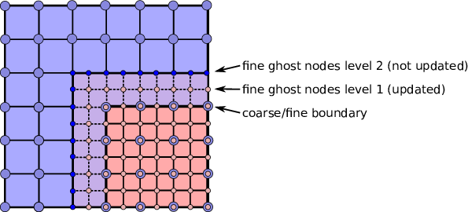

# MLMG and Linear Operator Classes

Multi-Level Multi-Grid or `MLMG` is a class for solving the linear system using the geometric multigrid method. The constructor of `MLMG` takes the reference to `MLLinOp`, an abstract base class of various linear operator classes, `MLABecLaplacian`, `MLPoisson`, `MLNodeLaplacian`, etc. We choose the type of linear operator class according to the type of linear system to solve. Examples of the linear operators include

- `MLABecLaplacian` for cell-centered canonical form (equation `eqn::abeclap`).
- `MLPoisson` for cell-centered constant coefficient Poisson's equation $\nabla^2 \phi = f$.
- `MLNodeLaplacian` for nodal variable coefficient Poisson's equation $\nabla \cdot (\sigma \nabla \phi) = f$.

The constructors of these linear operator classes are in the form like below

``` c++
MLABecLaplacian (const Vector<Geometry>& a_geom,
                 const Vector<BoxArray>& a_grids,
                 const Vector<DistributionMapping>& a_dmap,
                 const LPInfo& a_info = LPInfo(),
                 const Vector<FabFactory<FArrayBox> const*>& a_factory = {},
                 const int a_ncomp = 1);
```

It takes `Vectors` of `Geometry`, `BoxArray` and `DistributionMapping`. The arguments are `Vectors` because MLMG can do multi-level composite solves. If you are using it for single-level, you can do

``` c++
// Given Geometry geom, BoxArray grids, and DistributionMapping dmap on single level
MLABecLaplacian mlabeclaplacian({geom}, {grids}, {dmap});
```

to let the compiler construct `Vectors` for you. Recall that the classes `Vector`, `Geometry`, `BoxArray`, and `DistributionMapping` are defined in chapter `Chap:Basics`. There are two new classes that are optional parameters. `LPInfo` is a class for passing parameters. `FabFactory` is used in problems with embedded boundaries (chapter `Chap:EB`).

After the linear operator is built, we need to set up boundary conditions. This will be discussed later in section `sec:linearsolver:bc`.

## Coefficients

Next, we consider the coefficients for equation `eqn::abeclap`. For `MLPoisson`, there are no coefficients to set so nothing needs to be done. For `MLABecLaplacian`, we need to call member functions `setScalars`, `setACoeffs`, and `setBCoeffs`. The `setScalars` function sets the scalar constants $A$ and $B$

``` 
void setScalars (Real a, Real b) noexcept;
```

For the general case where $\alpha$ and $\beta$ are scalar fields, we use

> ``` 
> void setACoeffs (int amrlev, const MultiFab& alpha);
> void setBCoeffs (int amrlev, const Array<MultiFab const*,AMREX_SPACEDIM>& beta);
> ```

For the case where $\alpha$ and/or $\beta$ are scalar constants, there is the option to use

> ``` 
> void setACoeffs (int amrlev, Real alpha);
> void setBCoeffs (int amrlev, Real beta);
> void setBCoeffs (int amrlev, Vector<Real> const& beta);
> ```

Note, however, that the solver behavior is the same regardless of which functions you use to set the coefficients. These functions solely copy the constant value(s) to a MultiFab internal to `MLMG` and so no appreciable efficiency gains can be expected.

For `MLNodeLaplacian`, one can set a variable `sigma` with the member function

``` c++
void setSigma (int amrlev, const MultiFab& a_sigma);
```

or a constant `sigma` during declaration or definition

``` c++
MLNodeLaplacian (const Vector<Geometry>& a_geom,
                 const Vector<BoxArray>& a_grids,
                 const Vector<DistributionMapping>& a_dmap,
                 const LPInfo& a_info = LPInfo(),
                 const Vector<FabFactory<FArrayBox> const*>& a_factory = {},
                 Real  a_const_sigma = Real(0.0));

void define (const Vector<Geometry>& a_geom,
             const Vector<BoxArray>& a_grids,
             const Vector<DistributionMapping>& a_dmap,
             const LPInfo& a_info = LPInfo(),
             const Vector<FabFactory<FArrayBox> const*>& a_factory = {},
             Real  a_const_sigma = Real(0.0));
```

Here, setting a constant `sigma` alters the internal behavior of the solver making it more efficient for this special case.

The `int amrlev` parameter should be zero for single-level solves. For multi-level solves, each level needs to be provided with `alpha` and `beta`, or `sigma`. For composite solves, `amrlev` 0 will mean the lowest level for the solver, which is not necessarily the lowest level in the AMR hierarchy. This is so solves can be done on different sections of the AMR hierarchy, e.g. on AMR levels 3 to 5.

After boundary conditions and coefficients are prescribed, the linear operator is ready for an MLMG object like below.

``` C++
MLMG mlmg(mlabeclaplacian);
```

Optional parameters can be set (see section `sec:linearsolver:pars`), and then we can use the `MLMG` member function

``` C++
Real solve (const Vector<MultiFab*>& a_sol,
            const Vector<MultiFab const*>& a_rhs,
            Real a_tol_rel, Real a_tol_abs);
```

to solve the problem given an initial guess and a right-hand side. Zero is a perfectly fine initial guess. The two `Reals` in the argument list are the targeted relative and absolute error tolerances. The relative error tolerance is hard-coded to be at least $10^{-16}$. Given the linear system $Ax = b$, the solver will terminate when the max-norm of the residual ($b - Ax$) is less than `std::max(a_tol_abs, a_tol_rel * max_norm)`. By default, `max_norm` is equal to the greater of rhs max-norm and residual max-norm. This behavior can be modified using the `MLMG` member function `setConvergenceNormType (MLMGNormType norm)`, where the available options are

- `MLMGNormType::greater`: The default.
- `MLMGNormType::bnorm`: `max_norm` is set to rhs max-norm.
- `MLMGNormType::resnorm`: `max_norm` is set to residual max-norm.

Set the absolute tolerance to zero if one does not have a good value for it. The return value of `solve` is the max-norm error.

After the solver returns successfully, if needed, we can call

``` c++
void compResidual (const Vector<MultiFab*>& a_res,
                   const Vector<MultiFab*>& a_sol,
                   const Vector<MultiFab const*>& a_rhs);
```

to compute residual (i.e., $f - L(\phi)$) given the solution and the right-hand side. For cell-centered solvers, we can also call the following functions to compute gradient $\nabla \phi$ and fluxes $-\beta \nabla \phi$.

``` c++
void getGradSolution (const Vector<Array<MultiFab*,AMREX_SPACEDIM> >& a_grad_sol);
void getFluxes       (const Vector<Array<MultiFab*,AMREX_SPACEDIM> >& a_fluxes);
```

# Boundary Conditions

We now discuss how to set up boundary conditions for linear operators. In the following, physical domain boundaries refer to the boundaries of the physical domain, whereas coarse/fine boundaries refer to the boundaries between AMR levels. The following steps must be followed in the exact order.

1\) For any type of solver, we first need to set physical domain boundary types via the `MLLinOp` member function

``` c++
void setDomainBC (const Array<LinOpBCType,AMREX_SPACEDIM>& lobc,  // for lower ends
                  const Array<LinOpBCType,AMREX_SPACEDIM>& hibc); // for higher ends
```

The supported BC types at the physical domain boundaries are

- `LinOpBCType::Periodic` for periodic boundary.
- `LinOpBCType::Dirichlet` for Dirichlet boundary condition.
- `LinOpBCType::Neumann` for homogeneous Neumann boundary condition.
- `LinOpBCType::inhomogNeumann` for inhomogeneous Neumann boundary condition.
- `LinOpBCType::Robin` for Robin boundary conditions, $a\phi + b\frac{\partial\phi}{\partial n} = f$.
- `LinOpBCType::reflect_odd` for reflection with sign changed.

2\) Cell-centered solvers only: if we want to do a linear solve where the boundary conditions on the coarsest AMR level of the solve come from a coarser level (e.g. the base AMR level of the solve is \> 0 and does not cover the entire domain), we must explicitly provide the coarser data. Boundary conditions from a coarser level are Dirichlet by default and can be changed to homogeneous Neumann (i.e., `LinOpBCType::Neumann`).

Note that this step, if needed, must be performed before the step below. The `MLLinOp` member function for this step is

``` c++
void setCoarseFineBC (const MultiFab* crse, int crse_ratio,
                      LinOpBCType bc_type = LinOpBCType::Dirichlet);

void setCoarseFineBC (const MultiFab* crse, IntVect const& crse_ratio,
                      LinOpBCType bc_type = LinOpBCType::Dirichlet);
```

Here `const MultiFab* crse` contains the Dirichlet boundary values at the coarse resolution, and `int crse_ratio` (e.g., 2) is the refinement ratio between the coarsest solver level and the AMR level below it. The MultiFab `crse` does not need to have ghost cells itself. If the coarse grid bc's for the solve are identically zero, `nullptr` can be passed instead of `crse`.

3\) Cell-centered solvers only: before the solve one must always call the `MLLinOp` member function

``` c++
virtual void setLevelBC (int amrlev, const MultiFab* levelbcdata,
                         const MultiFab* robinbc_a = nullptr,
                         const MultiFab* robinbc_b = nullptr,
                         const MultiFab* robinbc_f = nullptr) = 0;
```

If we want to supply an inhomogeneous Dirichlet or inhomogeneous Neumann boundary condition at the domain boundaries, we must supply those values in `MultiFab* levelbcdata`, which must have at least one ghost cell. Note that the argument `amrlev` is relative to the solve, not necessarily the full AMR hierarchy; amrlev = 0 refers to the coarsest level of the solve.

If the boundary condition is Dirichlet the ghost cells outside the domain boundary of `levelbcdata` must hold the value of the solution at the domain boundary; if the boundary condition is Neumann those ghost cells must hold the value of the gradient of the solution normal to the boundary (e.g. it would hold dphi/dx on both the low and high faces in the x-direction).

If the boundary conditions contain no inhomogeneous Dirichlet or Neumann boundaries, we can pass `nullptr` instead of a MultiFab.

We can use the solution array itself to hold these values; the values are copied to internal arrays and will not be over-written when the solution array itself is being updated by the solver. Note, however, that this call does not provide an initial guess for the solve.

It should be emphasized that the data in `levelbcdata` for Dirichlet or Neumann boundaries are assumed to be exactly on the face of the physical domain; storing these values in the ghost cell of a cell-centered array is a convenience of implementation.

For Robin boundary conditions, the ghost cells in `MultiFab* robinbc_a`, `MultiFab* robinbc_b`, and `MultiFab* robinbc_f` store the numerical values in the condition, $a\phi + b\frac{\partial\phi}{\partial n} = f$.

4)  Nodal solver provides the option to use an overset mask:

``` c++
// omask is either 0 or 1. 1 means the node is an unknown. 0 means it's known.
void setOversetMask (int amrlev, const iMultiFab& a_dmask);
```

Note this is an integer (not bool) MultiFab, so the values must be only either 0 or 1.

# Parameters

There are many parameters that can be set. Here we discuss some commonly used ones.

`MLLinOp::setVerbose(int)`, `MLMG::setVerbose(int)` and `MLMG::setBottomVerbose(int)` control the verbosity of the linear operator, multigrid solver and the bottom solver, respectively.

The multigrid solver is an iterative solver. The maximal number of iterations can be changed with `MLMG::setMaxIter(int)`. We can also do a fixed number of iterations with `MLMG::setFixedIter(int)`. By default, V-cycle is used. We can use `MLMG::setMaxFmgIter(int)` to control how many full multigrid cycles can be done before switching to V-cycle.

`LPInfo::setMaxCoarseningLevel(int)` can be used to control the maximal number of multigrid levels. We usually should not call this function. However, we sometimes build the solver to simply apply the operator (e.g., $L(\phi)$) without needing to solve the system. We can do something as follows to avoid the cost of building coarsened operators for the multigrid.

``` c++
MLABecLaplacian mlabeclap({geom}, {grids}, {dmap}, LPInfo().setMaxCoarseningLevel(0));
// set up BC
// set up coefficients
MLMG mlmg(mlabeclap);
// out = L(in)
mlmg.apply(out, in);  // here both in and out are const Vector<MultiFab*>&
```

At the bottom of the multigrid cycles, we use a `bottom solver` which may be different than the relaxation used at the other levels. The default bottom solver is the biconjugate gradient stabilized method, but can easily be changed with the `MLMG` member method

``` c++
void setBottomSolver (BottomSolver s);
```

Available choices of the bottom solver are

- `MLMG::BottomSolver::bicgstab`: The default.
- `MLMG::BottomSolver::cg`: The conjugate gradient method. The matrix must be symmetric.
- `MLMG::BottomSolver::smoother`: Smoother such as Gauss-Seidel.
- `MLMG::BottomSolver::bicgcg`: Start with bicgstab. Switch to cg if bicgstab fails. The matrix must be symmetric.
- `MLMG::BottomSolver::cgbicg`: Start with cg. Switch to bicgstab if cg fails. The matrix must be symmetric.
- `MLMG::BottomSolver::hypre`: One of the solvers available through HYPRE; see the section below on External Solvers
- `MLMG::BottomSolver::petsc`: Currently for cell-centered only.

The `LPInfo` class can be used to control the agglomeration and consolidation strategy for multigrid coarsening.

- `LPInfo::setAgglomeration(bool)` (by default true) can be used to copy the current level of multigrid data to fewer, larger boxes. Two advantages of using this option is that the bottom solver will become smaller, and communication overhead is reduced.
- `LPInfo::setAgglomerationGridSize(int)` controls the grid-length threshold used for agglomeration. By default, the threshold length is set to 32 for GPU builds, and 8, 16 and 32 for CPU builds in 1D, 2D and 3D, respectively. The corresponding volume threshold is $L^D$, where $L$ is the length threshold and $D$ is `AMREX_SPACEDIM`. When the average box volume falls below this volume threshold, boxes are agglomerated until this is no longer the case. Note that this action is recursive and can happen at several different levels in the multigrid hierarchy.
- `LPInfo::setConsolidation(bool)` (by default true) can be used continue to transfer a multigrid problem to fewer MPI ranks. There are more setting such as `LPInfo::setConsolidationGridSize(int)`, `LPInfo::setConsolidationRatio(int)`, and `LPInfo::setConsolidationStrategy(int)`, to give control over how this process works. If agglomeration is used, consolidation is ignored.

`MLMG::setThrowException(bool)` controls whether multigrid failure results in aborting (default) or throwing an exception, whereby control will return to the calling application. The application code must catch the exception:

``` c++
try {
    mlmg.solve(...);
} catch (const MLMG::error& e) {
    Print()<<e.what()<<std::endl; //Prints description of error

    // Do something else...
}
```

Note that exceptions that are not caught are passed up the calling chain so that application codes using specialized solvers relying on MLMG can still catch the exception. For example, using AMReX-Hydro's `NodalProjector`

``` c++
try {
    nodal_projector.project(...);
} catch (const MLMG::error& e) {
    // Do something else...
}
```

# Boundary Stencils for Cell-Centered Solvers

We have the option using the `MLMG` member method

``` c++
void setMaxOrder (int maxorder);
```

to set the order of the cell-centered linear operator stencil at physical boundaries with Dirichlet boundary conditions and at coarse-fine boundaries. In both of these cases, the boundary value is not defined at the center of the ghost cell. The order determines the number of interior cells that are used in the extrapolation of the boundary value from the cell face to the center of the ghost cell, where the extrapolated value is then used in the regular stencil. For example, `maxorder = 2` uses the boundary value and the first interior value to extrapolate to the ghost cell center; `maxorder = 3` uses the boundary value and the first two interior values.

# Curvilinear Coordinates

Some of the linear solvers support curvilinear coordinates including 1D spherical and 2d cylindrical $(r,z)$. In those cases, the divergence operator has extra metric terms. If one does not want the solver to include the metric terms because they have been handled in other ways, one can turn them off with a setter function. For the cell-centered linear solvers <span class="title-ref">MLABecLaplacian</span> and <span class="title-ref">MLPoisson</span>, one can call `setMetricTerm(bool)` with `false` on the `LPInfo` object passed to the constructor of linear operators. For the node-based <span class="title-ref">MLNodeLaplacian</span>, one can call `setRZCorrection (bool)` with `false` on the <span class="title-ref">MLNodeLaplacian</span> object.

<span class="title-ref">MLABecLaplacian</span> and <span class="title-ref">MLPoisson</span> support both spherical and cylindrical coordinates, while <span class="title-ref">MLNodeLaplacian</span> supports only cylindrical at this time. Note that to use cylindrical coordinates with <span class="title-ref">MLNodeLaplacian</span>, the application code must scale `sigma` by the radial coordinate before calling `setSigma()`.

# Embedded Boundaries

AMReX supports multi-level solvers for use with embedded boundaries. These include 1) cell-centered solvers with homogeneous Neumann, homogeneous Dirichlet, or inhomogeneous Dirichlet boundary conditions on the EB faces, and 2) nodal solvers with homogeneous Neumann boundary conditions, or inflow velocity conditions on the EB faces.

To use a cell-centered solver with EB, one builds a linear operator `MLEBABecLap` with `EBFArrayBoxFactory` (instead of a `MLABecLaplacian`)

``` c++
MLEBABecLap (const Vector<Geometry>& a_geom,
             const Vector<BoxArray>& a_grids,
             const Vector<DistributionMapping>& a_dmap,
             const LPInfo& a_info,
             const Vector<EBFArrayBoxFactory const*>& a_factory);
```

The usage of this EB-specific class is essentially the same as `MLABecLaplacian`.

The default boundary condition on EB faces is homogeneous Neumann.

To set homogeneous Dirichlet boundary conditions, call

``` c++
ml_ebabeclap->setEBHomogDirichlet(lev, coeff);
```

where coeff can be a real number (i.e. the value is the same at every cell) or a MultiFab holding the coefficient of the gradient at each cell with an EB face. In other words, coeff is $\beta$ in the canonical form given in equation `eqn::abeclap` located at the EB surface centroid.

To set inhomogeneous Dirichlet boundary conditions, call

``` c++
ml_ebabeclap->setEBDirichlet(lev, phi_on_eb, coeff);
```

where phi_on_eb is the MultiFab holding the Dirichlet values in every cut cell, and coeff again is a real number or a MultiFab holding the coefficient of the gradient at each cell with an EB face, i.e. $\beta$ in equation `eqn::abeclap` located at the EB surface centroid.

Currently there are options to define the face-based coefficients on face centers vs face centroids, and to interpret the solution variable as being defined on cell centers vs cell centroids.

The default is for the solution variable to be defined at cell centers; to tell the solver to interpret the solution variable as living at cell centroids, you must set

``` c++
ml_ebabeclap->setPhiOnCentroid();
```

The default is for the face-based coefficients to be defined at face centers; to tell the that the face-based coefficients should be interpreted as living at face centroids, modify the setBCoeffs command to be

``` c++
ml_ebabeclap->setBCoeffs(lev, beta, MLMG::Location::FaceCentroid);
```

# External Solvers

AMReX provides interfaces to the [HYPRE](https://computing.llnl.gov/projects/hypre-scalable-linear-solvers-multigrid-methods) preconditioners and solvers, including BoomerAMG, GMRES (all variants), PCG, and BICGStab as solvers, and BoomerAMG and Euclid as preconditioners. These can be called as as bottom solvers for both cell-centered and node-based problems.

If it is built with HYPRE support, AMReX initializes HYPRE by default in <span class="title-ref">amrex::Initialize</span>. If it is built with CUDA, AMReX will also set up HYPRE to run on device by default. The user can choose to disable the HYPRE initialization by AMReX with `ParmParse` parameter `amrex.init_hypre=[0|1]`.

By default the AMReX linear solver code always tries to geometrically coarsen the problem as much as possible. However, as we have mentioned, we can call `setMaxCoarseningLevel(0)` on the `LPInfo` object passed to the constructor of a linear operator to disable the coarsening completely. In that case the bottom solver is solving the residual correction form of the original problem.

As of March 2025, AMReX supports and is tested with HYPRE version 2.32.0 (check `amrex/.github/workflows/hypre.yml` so see what versions are currently tested). To build HYPRE, follow the next steps:

``` console
1.- git clone https://github.com/hypre-space/hypre.git
2.- cd hypre/src
3.- git checkout v2.32.0
4.- ./configure
    (if you want to build HYPRE with long long int, do ./configure --enable-bigint )
5.- make install
6.- Create an environment variable with the HYPRE directory --
    HYPRE_DIR=/hypre_path/hypre/src/hypre
```

To use HYPRE with CUDA, nvcc compiler is needed along with all other requirements for CPU (e.g. gcc, mpicc). It is very important that the GPU architecture for HYPRE matches with that of AMReX. By default, HYPRE assumes its architecture number to be 70 and it is best to build HYPRE for multiple architectures by specifying multiple compute capability numbers (e.g. 80 and 90). If you see a runtime error similar to `terminate called after throwing an instance of 'thrust::system::system_error'`, you likely did not build for the correct architecture.

``` console
1.- git clone https://github.com/hypre-space/hypre.git
2.- cd hypre/src
3.- git checkout v2.32.0
4.- ./configure --with-cuda --with-gpu-arch='80 90' --enable-unified-memory
    (you can figure out the gpu arch from command line using
    nvidia-smi --query-gpu=compute_cap --format=csv, if it gives 9.0, gpu-arch is 90)
5.- make install
6.- Create an environment variable with the HYPRE directory --
    HYPRE_DIR=/hypre_path/hypre/src/hypre
```

To use HYPRE, one must include `amrex/Src/Extern/HYPRE` in the build system. For examples of using HYPRE, we refer the reader to [ABecLaplacian](https://amrex-codes.github.io/amrex/tutorials_html/LinearSolvers_Tutorial.html) or [NodeTensorLap](https://amrex-codes.github.io/amrex/tutorials_html/LinearSolvers_Tutorial.html).

The following parameter should be set to True if the problem to be solved has a singular matrix. In this case, the solution is only defined to within a constant. Setting this parameter to True replaces one row in the matrix sent to HYPRE from AMReX by a row that sets the value at one cell to 0.

- `hypre.adjust_singular_matrix`: Default is false.

The following parameters can be set in the inputs file to control the choice of preconditioner and smoother:

- `hypre.hypre_solver`: Default is BoomerAMG.
- `hypre.hypre_preconditioner`: Default is none; otherwise the type must be specified.
- `hypre.recompute_preconditioner`: Default true. Option to recompute the preconditioner.
- `hypre.write_matrix_files`: Default false. Option to write out matrix into text files.
- `hypre.overwrite_existing_matrix_files`: Default false. Option to over-write existing matrix files.

The following parameters can be set in the inputs file to control the BoomerAMG solver specifically:

- `hypre.bamg_verbose`: verbosity of BoomerAMG preconditioner. Default 0. See <span class="title-ref">HYPRE_BoomerAMGSetPrintLevel</span>
- `hypre.bamg_logging`: Default 0. See <span class="title-ref">HYPRE_BoomerAMGSetLogging</span>
- `hypre.bamg_coarsen_type`: Default 6. See <span class="title-ref">HYPRE_BoomerAMGSetCoarsenType</span>
- `hypre.bamg_cycle_type`: Default 1. See <span class="title-ref">HYPRE_BoomerAMGSetCycleType</span>
- `hypre.bamg_relax_type`: Default 6. See <span class="title-ref">HYPRE_BoomerAMGSetRelaxType</span>
- `hypre.bamg_relax_order`: Default 1. See <span class="title-ref">HYPRE_BoomerAMGSetRelaxOrder</span>
- `hypre.bamg_num_sweeps`: Default 2. See <span class="title-ref">HYPRE_BoomerAMGSetNumSweeps</span>
- `hypre.bamg_max_levels`: Default 20. See <span class="title-ref">HYPRE_BoomerAMGSetMaxLevels</span>
- `hypre.bamg_strong_threshold`: Default 0.25 for 2D, 0.57 for 3D. See <span class="title-ref">HYPRE_BoomerAMGSetStrongThreshold</span>
- `hypre.bamg_interp_type`: Default 0. See <span class="title-ref">HYPRE_BoomerAMGSetInterpType</span>

The user is referred to the [HYPRE](https://computing.llnl.gov/projects/hypre-scalable-linear-solvers-multigrid-methods) HYPRE Reference Manual for full details on the usage of the parameters described briefly above.

AMReX can also use [PETSc](https://www.mcs.anl.gov/petsc/) as a bottom solver for cell-centered problems. To build PETSc, follow the next steps:

``` console
1.- git clone https://github.com/petsc/petsc.git
2.- cd petsc
3.- ./configure --prefix=build_dir
4.- Invoke the ``make all'' command given at the end of the previous command output
5.- Invoke the ``make install'' command given at the end of the previous command output
6.- Create an environment variable with the PETSC directory --
    PETSC_DIR=/petsc_path/petsc/build_dir
```

To use PETSc, one must include `amrex/Src/Extern/PETSc` in the build system. For an example of using PETSc, we refer the reader to the tutorial, [ABecLaplacian](https://amrex-codes.github.io/amrex/tutorials_html/LinearSolvers_Tutorial.html).

# Tensor Solve

Application codes that solve the Navier-Stokes equations need to evaluate the viscous term; solving for this term implicitly requires a multi-component solve with cross terms. Because this is a commonly used motif, we provide a tensor solve for cell-centered velocity components.

Consider a velocity field $U = (u,v,w)$ with all components co-located on cell centers. The viscous term can be written in vector form as

$$\nabla \cdot (\eta \nabla U) + \nabla \cdot (\eta (\nabla U)^T ) + \nabla \cdot ( (\kappa - \frac{2}{3} \eta) (\nabla \cdot U) )$$

and in 3-d Cartesian component form as

$$( (\eta u_x)_x + (\eta u_y)_y + (\eta u_z)_z ) + ( (\eta u_x)_x + (\eta v_x)_y + (\eta w_x)_z ) +  ( (\kappa - \frac{2}{3} \eta) (u_x+v_y+w_z) )_x$$$$( (\eta v_x)_x + (\eta v_y)_y + (\eta v_z)_z ) + ( (\eta u_y)_x + (\eta v_y)_y + (\eta w_y)_z ) +  ( (\kappa - \frac{2}{3} \eta) (u_x+v_y+w_z) )_y$$$$( (\eta w_x)_x + (\eta w_y)_y + (\eta w_z)_z ) + ( (\eta u_z)_x + (\eta v_z)_y + (\eta w_z)_z ) +  ( (\kappa - \frac{2}{3} \eta) (u_x+v_y+w_z) )_z$$

Here $\eta$ is the dynamic viscosity and $\kappa$ is the bulk viscosity.

We evaluate the following terms from the above using the `MLABecLaplacian` and `MLEBABecLaplacian` operators;

$$( (\frac{4}{3} \eta + \kappa) u_x)_x + (              \eta           u_y)_y + (\eta u_z)_z$$$$(\eta           v_x)_x + ( (\frac{4}{3} \eta + \kappa) v_y)_y + (\eta v_z)_z$$$$(\eta w_x)_x                        + (              \eta           w_y)_y + ( (\frac{4}{3} \eta + \kappa) w_z)_z$$

the following cross-terms are evaluated separately using the `MLTensorOp` and `MLEBTensorOp` operators.

$$( (\kappa - \frac{2}{3} \eta) (v_y + w_z) )_x + (\eta v_x)_y  + (\eta w_x)_z$$$$(\eta u_y)_x + ( (\kappa - \frac{2}{3} \eta) (u_x + w_z) )_y  + (\eta w_y)_z$$$$(\eta u_z)_x + (\eta v_z)_y + ( (\kappa - \frac{2}{3} \eta) (u_x + v_y) )_z$$

The code below is an example of how to set up the solver to compute the viscous term <span class="title-ref">divtau</span> explicitly:

``` c++
Box domain(geom[0].Domain());

// Set BCs for Poisson solver in bc_lo, bc_hi
...

//
// First define the operator "ebtensorop"
// Note we call LPInfo().setMaxCoarseningLevel(0) because we are only applying the operator,
//      not doing an implicit solve
//
//       (alpha * a - beta * (del dot b grad)) sol
//
// LPInfo                       info;
MLEBTensorOp ebtensorop(geom, grids, dmap, LPInfo().setMaxCoarseningLevel(0),
                        amrex::GetVecOfConstPtrs(ebfactory));

// It is essential that we set MaxOrder of the solver to 2
// if we want to use the standard sol(i)-sol(i-1) approximation
// for the gradient at Dirichlet boundaries.
// The solver's default order is 3 and this uses three points for the
// gradient at a Dirichlet boundary.
ebtensorop.setMaxOrder(2);

// LinOpBCType Definitions are in amrex/Src/Boundary/AMReX_LO_BCTYPES.H
ebtensorop.setDomainBC ( {(LinOpBCType)bc_lo[0], (LinOpBCType)bc_lo[1], (LinOpBCType)bc_lo[2]},
                         {(LinOpBCType)bc_hi[0], (LinOpBCType)bc_hi[1], (LinOpBCType)bc_hi[2]} );

// Return div (eta grad)) phi
ebtensorop.setScalars(0.0, -1.0);

amrex::Vector`amrex::Array<std::unique_ptr<amrex::MultiFab`, AMREX_SPACEDIM>> b;
b.resize(max_level + 1);

// Compute the coefficients
for (int lev = 0; lev < nlev; lev++)
{
    // We average eta onto faces
    for(int dir = 0; dir < AMREX_SPACEDIM; dir++)
    {
        BoxArray edge_ba = grids[lev];
        edge_ba.surroundingNodes(dir);
        b[lev][dir] = std::make_unique<MultiFab>(edge_ba, dmap[lev], 1, nghost, MFInfo(), *ebfactory[lev]);
    }

    average_cellcenter_to_face( GetArrOfPtrs(b[lev]), *etan[lev], geom[lev] );

    b[lev][0] -> FillBoundary(geom[lev].periodicity());
    b[lev][1] -> FillBoundary(geom[lev].periodicity());
    b[lev][2] -> FillBoundary(geom[lev].periodicity());

    ebtensorop.setShearViscosity  (lev, GetArrOfConstPtrs(b[lev]));
    ebtensorop.setEBShearViscosity(lev, (*eta[lev]));

    ebtensorop.setLevelBC ( lev, GetVecOfConstPtrs(vel)[lev] );
}

MLMG solver(ebtensorop);

solver.apply(GetVecOfPtrs(divtau), GetVecOfPtrs(vel));
```

# Multi-Component Operators

This section discusses solving linear systems in which the solution variable $\mathbf{\phi}$ has multiple components. An example (implemented in the `MultiComponent` tutorial) might be:

$$D(\mathbf{\phi})_i = \sum_{i=1}^N \alpha_{ij} \nabla^2 \phi_j$$

(Note: only operators of the form $D:\mathbb{R}^n\to\mathbb{R}^n$ are currently allowed.)

- To implement a multi-component *cell-based* operator, inherit from the `MLCellLinOp` class. Override the `getNComp` function to return the number of components (`N`)that the operator will use. The solution and rhs fabs must also have at least one ghost node. `Fapply`, `Fsmooth`, `Fflux` must be implemented such that the solution and rhs fabs all have `N` components.

- Implementing a multi-component *node-based* operator is slightly different. A MC nodal operator must specify that the reflux-free coarse/fine strategy is being used by the solver.

  ``` 
  solver.setCFStrategy(MLMG::CFStrategy::ghostnodes);
  ```

  The reflux-free method circumvents the need to implement a special `reflux` at the coarse-fine boundary. This is accomplished by using ghost nodes. Each AMR level must have 2 layers of ghost nodes. The second (outermost) layer of nodes is treated as constant by the relaxation, essentially acting as a Dirichlet boundary. The first layer of nodes is evolved using the relaxation, in the same manner as the rest of the solution. When the residual is restricted onto the coarse level (in `reflux`) this allows the residual at the coarse-fine boundary to be interpolated using the first layer of ghost nodes. `fig::refluxfreecoarsefine` illustrates the how the coarse-fine update takes place.

  <figure>
  
  <figcaption>Reflux-free coarse-fine boundary update. Level 2 ghost nodes (small dark blue) are interpolated from coarse boundary. Level 1 ghost nodes are updated during the relaxation along with all the other interior fine nodes. Coarse nodes (large blue) on the coarse/fine boundary are updated by restricting with interior nodes and the first level of ghost nodes. Coarse nodes underneath level 2 ghost nodes are not updated. The remaining coarse nodes are updates by restriction.</figcaption>
  </figure>

  The MC nodal operator can inherit from the `MCNodeLinOp` class. `Fapply`, `Fsmooth`, and `Fflux` must update level 1 ghost nodes that are inside the domain. <span class="title-ref">interpolation</span> and <span class="title-ref">restriction</span> can be implemented as usual. <span class="title-ref">reflux</span> is a straightforward restriction from fine to coarse, using level 1 ghost nodes for restriction as described above.

See `amrex-tutorials/ExampleCodes/LinearSolvers/MultiComponent` for a complete working example.

# Curl-Curl

The curl-curl solver supports solving the linear system arising from the discretized form of

$$\nabla \times (\alpha \nabla \times \vec{E}) + \beta \vec{E} = \vec{f},$$

where $\vec{E}$ and $\vec{f}$ are defined on cell edges, $\alpha$ is a positive scalar, and $\beta$ is a non-negative scalar (either a constant or a field). An `Array` of three `MultiFab`s is used to store the components of $\vec{E}$ and $\vec{f}$. It's the user's responsibility to ensure that the right-hand-side data are consistent on edges shared by multiple `Box`es. If needed, you can call `MLCurlCurl::prepareRHS` to perform this synchronization.

The solver supports 1D, 2D and 3D. Note that even in the 1D and 2D cases, $\vec{E}$ still has three components, one for each spatial direction.

# Open Boundary Poisson Solver

To solve Poisson's equation for isolated sources (i.e., no sources outside the boundary), there are several options. One option is to use `MLMG` and `MLPoisson` with Dirichlet boundary conditions. The Dirichlet boundary values can be computed using the multipole method, as done in the Castro code (see e.g., https://amrex-astro.github.io/Castro/docs/file/Gravity_8H.html#_CPPv49multipole). Another option is to use the FFT based solver `amrex::FFT::PoissonOpenBC` (see chapter `Chap:FFT`). A third option is `amrex::OpenBCSolver`, which implements the James's method ("The Solution of Poisson's Equation for Isolated Source Distributions", R. A. James, 1977, Journal of Computational Physics, 25, 71). Below are some of the member functions of `OpenBCSolver`.

``` c++
OpenBCSolver (const Vector<Geometry>& a_geom,
              const Vector<BoxArray>& a_grids,
              const Vector<DistributionMapping>& a_dmap,
              const LPInfo& a_info = LPInfo());

Real solve (const Vector<MultiFab*>& a_sol,
            const Vector<MultiFab const*>& a_rhs,
             Real a_tol_rel, Real a_tol_abs);
```

# GMRES

AMReX provides a template implementation of the generalized minimal residual method (GMRES). The class template parameters are `V` for a linear algebra vector class and `M` for a linear operator class. The linear algebra vector class can contain one or several `MultiFab`s, or your own data container. The linear operator class represents a matrix conceptually. Although it does not need to store the matrix explicitly, it must be able to apply the matrix vector product for a given vector. It also must provide some basic operations such as dot product and linear combination. For the full set of requirements on the operator class, see https://amrex-codes.github.io/amrex/doxygen/classamrex_1_1GMRES.html#details.

An example of using GMRES combined with a Jacobi preconditioner to solve Poisson's equation can be found at https://amrex-codes.github.io/amrex/tutorials_html/LinearSolvers_Tutorial.html.

AMReX also provides `GMRESMLMGT`, a class template that solves the linear system in `MLMG` using GMRES with `MLMG` itself serving as the preconditioner.
